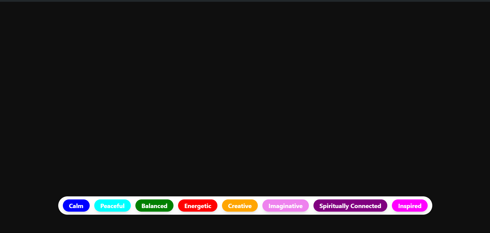

# BG Changer

## Description

This project is built using React and Tailwind CSS. It features background changing functionality similar to the Monkeytype website. Users can experience dynamic background changes while using the application.

## Features

- Dynamic background changing functionality
- React components for seamless UI interactions
- Utilizes Tailwind CSS for responsive and customizable styling

## Screenshots

## Installation

1. Clone the repository: `https://github.com/rohanvinkare/BG-Changer.git`
2. Navigate to the project directory: `cd BG-Changer`
3. Install dependencies: `npm install`

## Usage

1. Start the development server: `npm run dev`
2. Open your browser and navigate to `http://localhost:3000`

## Technologies Used

- React
- Tailwind CSS

## Contributing

1. Fork the repository
2. Create your feature branch: `git checkout -b feature-name`
3. Commit your changes: `git commit -am 'Add new feature'`
4. Push to the branch: `git push origin feature-name`
5. Submit a pull request

## Acknowledgements

- [Monkeytype](https://www.monkeytype.com/) for inspiration
